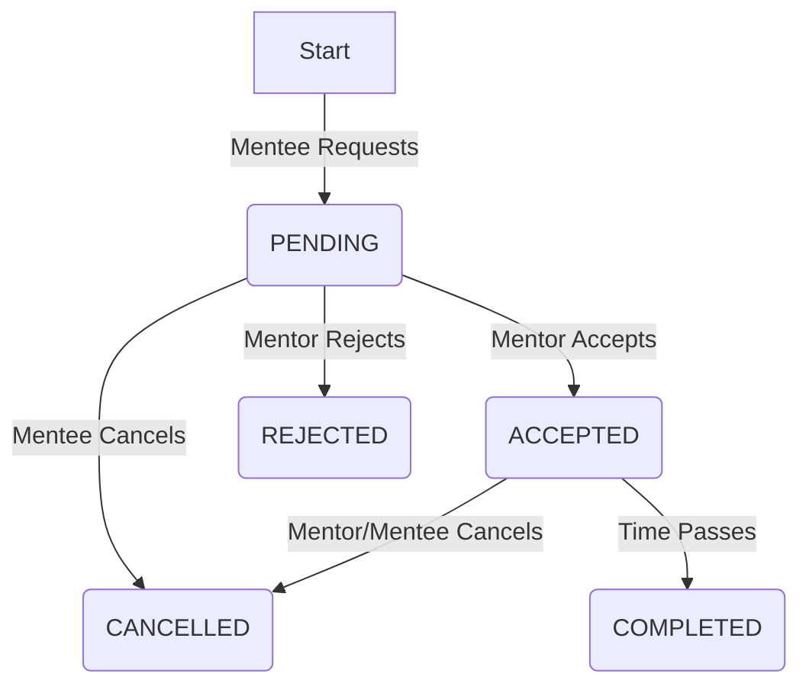

# Booking Workflow Documentation

This document describes the lifecycle and status workflow of a **Booking** in the 70-30 platform.

## Overview

A **Booking** represents a request for a mentorship session between a **Mentee** (requester) and a **Mentor** (provider). The booking goes through several states from creation to completion.

## Status Workflow

The `Booking` model uses the following status values:
- `PENDING`: Initial state when created.
- `ACCEPTED`: Mentor has agreed to the session.
- `REJECTED`: Mentor has declined the request.
- `CANCELLED`: Either party has cancelled the booking before it happened.
- `COMPLETED`: The session has taken place (future implementation).

### State Transitions



## API Endpoints

### 1. Request a Session (Create)
**URL**: `POST /api/bookings/`
**Auth**: Authenticated User (Mentee)
**Body**:
```json
{
  "mentor": 1,
  "skill": 5,
  "start_time": "2026-02-20T10:00:00Z",
  "end_time": "2026-02-20T11:00:00Z",
  "note": "I'd like help with Python."
}
```
**Status**: `201 Created` -> `PENDING`

### 2. Accept a Request
**URL**: `POST /api/bookings/{id}/accept/`
**Auth**: Mentor (Must be the `mentor` of the booking)
**Condition**: Booking must be `PENDING`.
**Status**: `200 OK` -> `ACCEPTED`

### 3. Reject a Request
**URL**: `POST /api/bookings/{id}/reject/`
**Auth**: Mentor (Must be the `mentor` of the booking)
**Status**: `200 OK` -> `REJECTED`

### 4. Cancel a Request
**URL**: `POST /api/bookings/{id}/cancel/`
**Auth**: Mentor OR Mentee
**Status**: `200 OK` -> `CANCELLED`

## Validation Rules
1.  **No Self-Booking**: A user cannot book themselves.
2.  **Future Dates Only**: Start time must be in the future.
3.  **End > Start**: End time must be after start time.
4.  **Double-Booking Prevention**:
    -   A Mentor cannot be booked if they already have an `ACCEPTED` booking overlapping the requested time.
    -   A Mentee cannot book if they already have an `ACCEPTED` booking (as mentee or mentor) overlapping the requested time.
